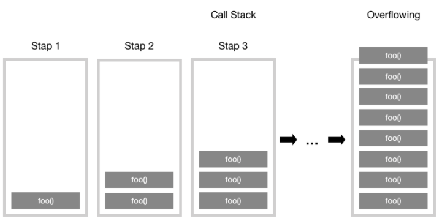

JS는 Memory Heap, Call Stack 으로 구성되어있다.


## `Memory Heap`
>객체는 힙, 대부분 구조화 되지 않은 메모리 영역에 할당된다. 변수와 객체에 대한 모든 메모리 할당은 여기서 발생한다.

## `Call Stack`
>코드가 실행될 때 호출 스택이 쌓인다.

## Runtime
___

브라우저에는 자바스크립트 개발자가 사용하는 거의 모든  API가 있습니다(예: setTimeout ). 그러나 이런 API 들은 엔진에서 제공해주지 않습니다. 그렇다면 이 API들은 어디서 오는 걸까요?


`사실 브라우저는 단순히 엔진 하나만으로 구성되어 있지 않습니다.` DOM, AJAX, setTimeout 등의 브라우저에서 제공하는 `Web API`라고 하는 것들이 있습니다. 또한 이러한 Web API의 호출을 통제하기 위한 `Event Queue`와 `Event Loop`도 존재합니다.

## Call Stack
___

자바스크립트는 단일 스레드 프로그래밍 언어이므로, 단일 호출 스택이 있습니다. 단일 호출 스택이 있다는 뜻은 한 번에 하나의 일(Task)만 처리할 수 있다는 뜻입니다.


호출 스택이란 프로그램에서 우리가 어디에 있는지를 기본적으로 기록하는 데이터 구조입니다. 동작 방식은 다음과 같습니다. 함수를 실행하면 해당 함수의 기록을 스택 맨 위에 추가(Push) 합니다. 우리가 함수를 결과 값을 반환하면 스택에 쌓여있던 함수는 제거(Pop) 됩니다. 예제를 살펴보도록 하죠.


```js
function multiply(x, y) {
    return x * y;
}
function printSquare(x) {
    var s = multiply(x, x);
    console.log(s);
}
printSquare(5);
```
> 엔진이 이 코드를 실행하기 전에는 호출 스택이 비어있습니다. 가장 아랫줄에 printSquare 함수가 실행되면 이후 단계는 다음과 같습니다.


## 예외 처리 시 스택의 동작
___


## `Stack overFlow`
이름 그대로 스택의 사이즈를 초과 했을 때 발생하는 오류입니다. 스택 오버플로우는 생각보다 쉽게 일어날 수 있습니다. 특히 재귀를 호출했을 때 말이죠.

```js
function foo() {
    foo();
}
foo();
```
마지막 줄에서 foo() 함수가 실행되는데, foo() 함수의 내부를 살펴보면 종료 조건 없이 자신을 계속해서 호출하게 됩니다. 따라서 함수의 스택 프레임이 계속해서 호출 스택에 쌓이게 됩니다.




그러다가 어떠한 시점에서 호출 스택의 함수 호출 수가 호출 스택의 실제 크기를 초과하게 되고, 브라우저는 다음과 같은 오류를 발생시키는 것으로 함수를 종료 시킵니다.


## 단일 호출 스택의 문제점
___

단일 스레드에서 코드를 실행하는 것은 멀티 스레드 환경에서 발생하는 복잡한 시나리오(예: deadlocks)를 고려할 필요가 없으므로 매우 쉽습니다. 그러나 단일 스레드에서 실행하는 것도 상당히 제한적입니다. `자바스크립트에서는 하나의 호출 스택만 있기 때문에, 하나의 함수 처리가 엄청 느려서 다른 함수 실행에 지장을 줄 때는 어떻게 해야 할까요`?

예를 들어, 브라우저에서 복잡한 이미지 처리를 한다고 생각해봅시다. 앞서 배운 호출 스택의 동작 방식을 생각 해볼 때, 이미지 처리 작업 스택을 차지하고 있으면 자바스크립트는 후속 작업들을 처리할 수 없습니다. 단일 스레드, 단일 호출 스택이기 때문입니다.

문제는 이것뿐만이 아닙니다. 브라우저가 호출 스택에서 많은 작업을 처리하기 시작하면 꽤 오랜 시간 동안 응답을 멈출 수 있습니다. 대부분의 브라우저는 이 상황에서 웹 페이지를 종료할지 여부를 묻는 오류 메시지를 표시합니다. 그렇다면 해결 방법은 무엇일까요?


## `Asynchronous callbacks`

가장 쉬운 해결책은 비동기 콜백을 사용하는 것입니다. 즉, 우리의 코드 일부를 실행하고 나중에 실행될 콜백(함수)를 제공합니다. 비동기 콜백은 즉시가 아닌, 특수한 시점에 실행되므로 console.log와 같은 동기 함수와는 다르게 스택 안에 바로 push 될 필요가 없습니다. 그런데 스택이 아니라면 이 콜백 함수들은 누가 관리하는 걸까요?


## `이벤트 큐(Event Queue)와 비동기 콜백의 처리 과정`
자바스크립트 실행환경(Runtime)은 이벤트 큐(Event Queue)를 가지고 있습니다. 이는 처리할 메시지 목록과 실행할 콜백 함수 들의 리스트입니다.


그럼 비동기가 처리되는 과정을 살펴봅시다. 우선 버튼 클릭과 같은 이벤트가 발생하면 DOM 이벤트, http 요청, setTimeout 등과 같은 비동기 함수는 C++로 구현된 web API를 호출하며, web API는 콜백 함수를 이벤트 큐(콜백 큐)에 밀어 넣습니다. 그럼 이벤트 큐는 대기하다가 스택이 텅 비는 시점에 이벤트 루프를 돌리게 됩니다(스택에 넣음). 이벤트 루프의 기본 역할은 큐와 스택, 두 부분을 지켜보다가 스택이 비는 시점에 콜백을 실행시켜 주는 것. 각 메시지와 콜백은 다른 메시지가 처리되기 전에 완전히 처리됩니다.

웹 브라우저에서는 이벤트가 발생할 때마다 메시지가 추가되고 이벤트 리스너가 첨부됩니다. 따라서 리스너가 없으면 이벤트가 손실됩니다. 콜백 함수의 호출은 호출 스택의 초기 프레임으로 사용되며, 자바스크립트가 싱글 스레드이므로 스택에 대한 모든 호출이 반환될 때까지 메세지 폴링(polling) 및 처리가 중지됩니다. 동기식 함수 호출은 이와 반대로 새 호출 프레임을 스택에 추가합니다.


[싸이클 테스트 사이트](http://latentflip.com/loupe/?code=JC5vbignYnV0dG9uJywgJ2NsaWNrJywgZnVuY3Rpb24gb25DbGljaygpIHsKICAgIHNldFRpbWVvdXQoZnVuY3Rpb24gdGltZXIoKSB7CiAgICAgICAgY29uc29sZS5sb2coJ1lvdSBjbGlja2VkIHRoZSBidXR0b24hJyk7ICAgIAogICAgfSwgMjAwMCk7Cn0pOwoKY29uc29sZS5sb2coIkhpISIpOwoKc2V0VGltZW91dChmdW5jdGlvbiB0aW1lb3V0KCkgewogICAgY29uc29sZS5sb2coIkNsaWNrIHRoZSBidXR0b24hIik7Cn0sIDUwMDApOwoKY29uc29sZS5sb2coIldlbGNvbWUgdG8gbG91cGUuIik7!!!PGJ1dHRvbj5DbGljayBtZSE8L2J1dHRvbj4%3D)
