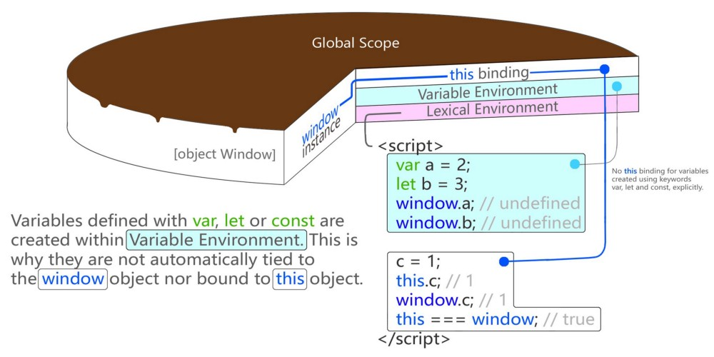
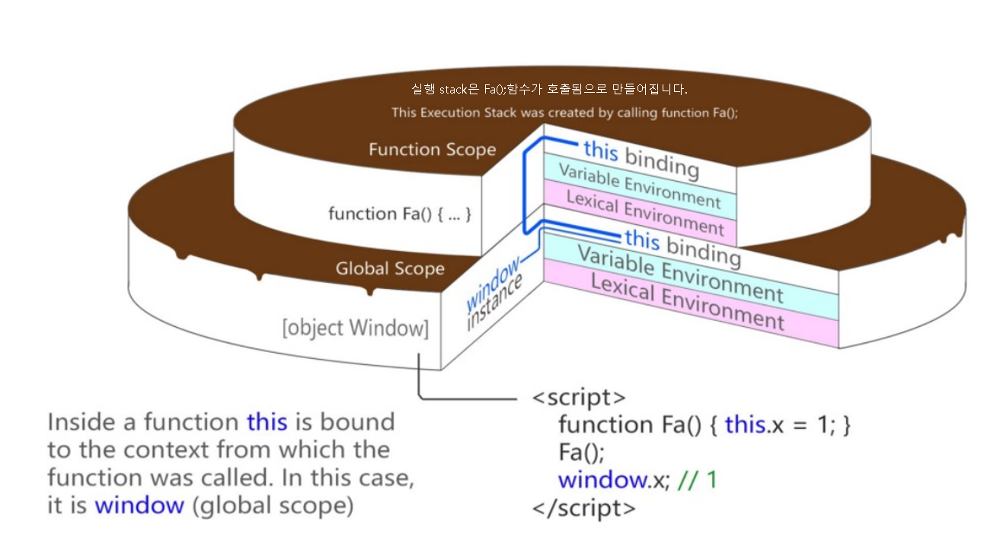
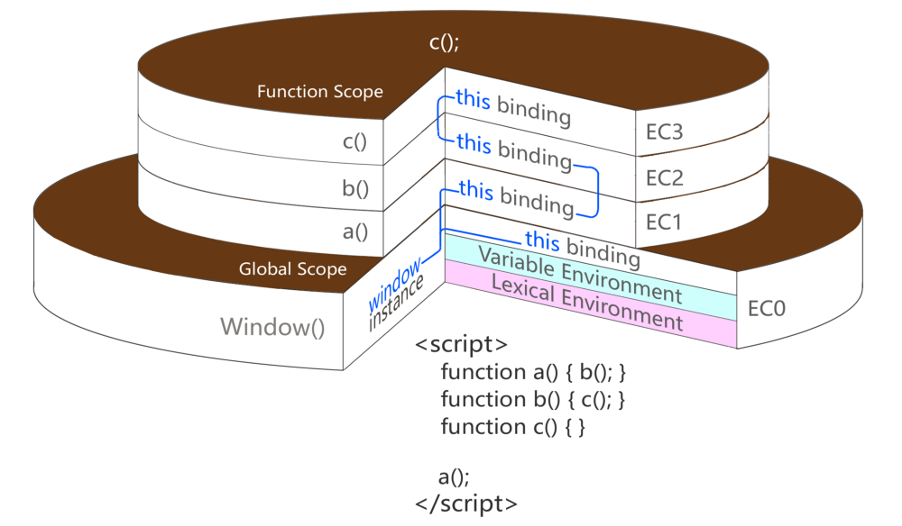

## JavaScript Interpretation and Memory Model
___

* 먼저 전역 컨텍스트 하나 생성 후, 함수 호출 시마다 컨텍스트가 생깁니다.
* 컨텍스트 생성 시 컨텍스트 안에 변수객체(arguments, variable), scope chain, this가 생성됩니다.
* 컨텍스트 생성 후 함수가 실행되는데, 사용되는 변수들은 변수 객체 안에서 값을 찾고, 없다면 스코프 체인을 따라 올라가며 찾습니다.
* 함수 실행이 마무리되면 해당 컨텍스트는 사라집니다.(클로저 제외) 페이지가 종료되면 전역 컨텍스트가 사라집니다.

>var, let 또는 const로 정의 된 변수는 Variable Environment 내에서 생성됩니다. 이것이 그들이 자동으로 window object에 연결되거나 this 개체에 연결되지 않는 이유입니다.

A new Execution Context is spawned from a scope containing variable definition and the binding of the this object. Essentially the this object in a given EC is the link to the object context under which it operates:

새 실행 컨텍스트는 변수 정의와이 개체의 바인딩을 포함하는 범위에서 생성됩니다. 본질적으로 주어진 EC에서 이 객체는 작동하는 객체 컨텍스트에 대한 링크입니다.

>함수 내부에서 함수가 호출 된 컨텍스트에 바인딩되었습니다. 이 window (global scope)

A new Execution Context is caused by a function call. This new Execution Context is then placed on top of Execution Stack (or The Call Stack.)
A new Execution Context can also be created when an object is instantiated but its only because object instantiation is a constructor function call.
From then on, whatever functions you call or whatever objects you instantiate will cause a new execution context created & pushed onto the stack. This process repeats while maintaining a this object chain all the way up to the currently executing context (the topmost one):

새로운 `Execution Context`는 함수 호출로 인해 발생합니다. 이 새로운 실행 컨텍스트는 실행 스택(또는 호출 스택)의 맨 위에 배치됩니다.
새 실행 컨텍스트는 개체가 인스턴스화 될 때도 생성 될 수 있지만 개체 인스턴스화는 생성자 함수 호출이기 때문입니다.
그때부터 호출하는 함수 나 인스턴스화하는 객체가 생성되고 스택에 푸시되는 새로운 실행 컨텍스트가 발생합니다. 이 프로세스는 현재 실행중인 컨텍스트 (최상위 컨텍스트)까지이 개체 체인을 유지하면서 반복됩니다.

There is always one currently executing context. The rest are stacked below.
After the function is finished executing the stack is removed from the top and the code control flow returns to the previous / uppermost execution context.
In other words its a LIFO (Last In First Out) order.
Noteworthy: This “stacking” occurs only when you call a function from the scope of another function. And that function, yet calls another one from its own scope. Thus, creating not only a stack of, but also a chain of contexts tied by the this object — related to the scope in which function was executed.
Stacking will not happen no matter how many function calls are made in the same Lexical Environment / scope. They all just push and pop within the same environment.

현재 실행중인 컨텍스트는 항상 하나입니다. 나머지는 아래에 쌓여 있습니다.
함수 실행이 완료되면 스택이 맨 위에서 제거되고 코드 제어 흐름이 이전 / 최상위 실행 컨텍스트로 돌아갑니다.
즉, `LIFO` (Last In First Out) 주문입니다.
참고 :이 `스태킹`은 다른 함수의 범위에서 함수를 호출 할 때만 발생합니다. 그리고 그 함수는 자체 범위에서 다른 함수를 호출합니다. 따라서 스택뿐만 아니라 함수가 실행 된 범위와 관련된 this 개체에 의해 연결된 컨텍스트 체인도 생성됩니다.
동일한 Lexical 환경 / 범위에서 얼마나 많은 함수 호출이 이루어 지더라도 스택이 발생하지 않습니다. 그들은 모두 동일한 환경에서 밀고 튀어 나옵니다.

