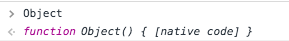
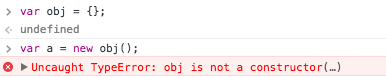
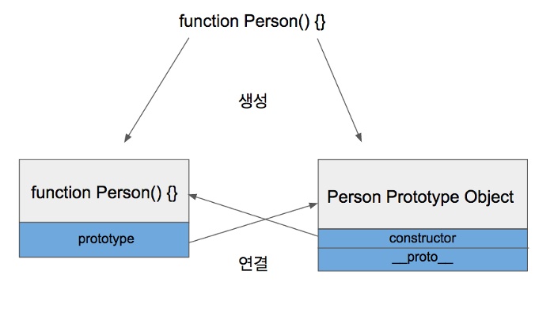
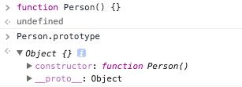
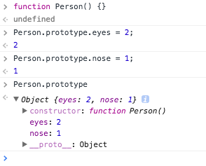
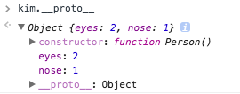
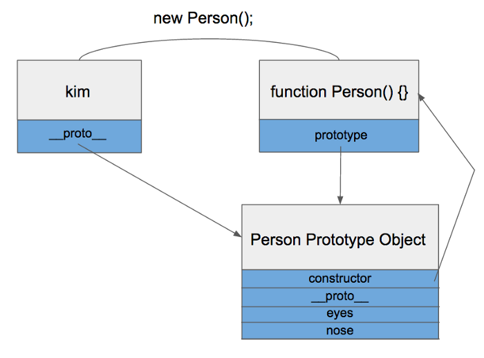
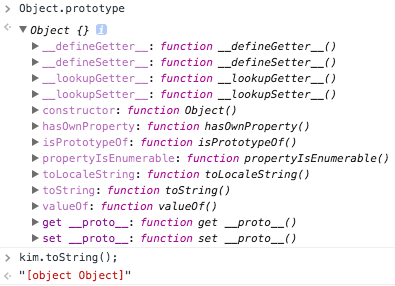

## Prototype vs Class
___

클래스(Class)라는 것을 한 번쯤은 들어보셨을겁니다. Java, Python, Ruby등 객체지향언어에서 빠질 수 없는 개념이죠. 그런데 중요한 점은 자바스크립트도 객체지향언어라는 것입니다. 이게 왜 중요하냐구요? 자바스크립트에는 클래스라는 개념이 없거든요. 대신 프로토타입(Prototype)이라는 것이 존재합니다. 자바스크립트가 프로토타입 기반 언어라고 불리는 이유이죠.
클래스가 없으니 기본적으로 상속기능도 없습니다. 그래서 보통 프로토타입을 기반으로 상속을 흉내내도록 구현해 사용합니다.

참고로 최근의 ECMA6 표준에서는 Class 문법이 추가되었습니다. 하지만 문법이 추가되었다는 것이지, 자바스크립트가 클래스 기반으로 바뀌었다는 것은 아닙니다.


> 자바스크립트에 클래스는 없지만 함수(function)와 new를 통해 클래스를 비슷하게 흉내낼 수 있습니다.

```js
function Person() {
  this.eyes = 2;
  this.nose = 1;
}
var kim  = new Person();
var park = new Person();
console.log(kim.eyes);  // => 2
console.log(kim.nose);  // => 1
console.log(park.eyes); // => 2
console.log(park.nose); // => 1
```

kim과 park은 eyes와 nose를 공통적으로 가지고 있는데, 메모리에는 eyes와 nose가 두 개씩 총 4개 할당됩니다. 객체를100개 만들면 200개의 변수가 메모리에 할당되겠죠?
바로 이런 문제를 프로토타입으로 해결할 수 있습니다.

```js
function Person() {}
Person.prototype.eyes = 2;
Person.prototype.nose = 1;
var kim  = new Person();
var park = new Person():
console.log(kim.eyes); // => 2
...
```

자바스크립트 개발을 하시는 분이라면 아마 써보진 않았어도 최소한 본 적은 있을겁니다. 간단히 설명하자면 Person.prototype이라는 빈 Object가 어딘가에 존재하고, Person 함수로부터 생성된 객체(kim, park)들은 어딘가에 존재하는 Object에 들어있는 값을 모두 갖다쓸 수 있습니다.
즉, eyes와 nose를 어딘가에 있는 빈 공간에 넣어놓고 kim과 park이 공유해서 사용하는 것이다.


## Prototype Link와 Prototype Object
___
자바스크립트에는 `Prototype Link` 와 `Prototype Object`라는 것이 존재합니다. 그리고 이 둘을 통틀어 Prototype이라고 부릅니다

## `Prototype Object`
객체는 언제나 함수(Function)로 생성됩니다.

```js
function Person() {} // => 함수
var personObject = new Person(); // => 함수로 객체를 생성
```
personObject 객체는 Person이라는 함수로 생성된 객체입니다. 이렇듯 언제나 객체는 함수에서 시작됩니다. 여러분이 많이 쓰는 일반적인 객체 생성도 예외는 아닙니다.


```js
var obj = {};
```

얼핏보면 함수랑 전혀 상관없는 코드로 보이지만 위 코드는 사실 다음 코드와 같습니다.

```js
var obj = new Object();
```
위 코드에서 Object가 자바스크립트에서 기본적으로 제공하는 함수입니다.


 
 Object와 마찬가지로 Function, Array도 모두 함수로 정의되어 있습니다. 이것이 첫 번째 포인트입니다.


## 함수가 정의될 때는 2가지 일이 동시에 이루어집니다.
___
## `1. 해당 함수에 Constructor(생성자) 자격 부여`
Constructor 자격이 부여되면 new를 통해 객체를 만들어 낼 수 있게 됩니다. 이것이 함수만 new 키워드를 사용할 수 있는 이유입니다.


 

> constructor가 아니면 newf를 사용할수 없다.

## `2.해당 함수의 Prototype Object 생성 및 연결`
함수를 정의하면 함수만 생성되는 것이 아니라 Prototype Object도 같이 생성이 됩니다.

 

그리고 생성된 함수는 prototype이라는 속성을 통해 Prototype Object에 접근할 수 있습니다. Prototype Object는 일반적인 객체와 같으며 기본적인 속성으로 constructor와 __proto__를 가지고 있습니다.

 

constructor는 Prototype Object와 같이 생성되었던 함수를 가리키고 있습니다.
__proto__는 Prototype Link입니다

이제 위에서 kim과 park이 나왔던 예제를 다시 보겠습니다.
```js
function Person() {}
Person.prototype.eyes = 2;
Person.prototype.nose = 1;
var kim  = new Person();
var park = new Person():
console.log(kim.eyes); // => 2
...
```
> 

Prototype Object는 일반적인 객체이므로 속성을 마음대로 추가/삭제 할 수 있습니다. kim과 park은 Person 함수를 통해 생성되었으니 Person.prototype을 참조할 수 있게 됩니다.


## `Prototype Link`


kim에는 eyes라는 속성이 없는데도 kim.eyes를 실행하면 2라는 값을 참조하는 것을 볼 수 있습니다. 위에서 설명했듯이 Prototype Object에 존재하는 eyes 속성을 참조한 것인데요, 이게 어떻게 가능한걸까요??
바로 kim이 가지고 있는 딱 하나의 속성 __proto__가 그것을 가능하게 해주는 열쇠입니다.
prototype 속성은 함수만 가지고 있던 것과는 달리(Person.prototype 기억나시죠?)
__proto__속성은 모든 객체가 빠짐없이 가지고 있는 속성입니다.
__proto__는 객체가 생성될 때 조상이었던 함수의 Prototype Object를 가리킵니다. kim객체는 Person함수로부터 생성되었으니 Person 함수의 Prototype Object를 가리키고 있는 것이죠.

 

> __proto__를 보니 Person 함수의 Prototype Object를 가리키고 있었습니다.

 

kim객체가 eyes를 직접 가지고 있지 않기 때문에 eyes 속성을 찾을 때 까지 상위 프로토타입을 탐색합니다. 최상위인 Object의 Prototype Object까지 도달했는데도 못찾았을 경우 undefined를 리턴합니다. 이렇게 __proto__속성을 통해 상위 프로토타입과 연결되어있는 형태를 프로토타입 체인(Chain)이라고 합니다.

 

이런 프로토타입 체인 구조 때문에 모든 객체는 Object의 자식이라고 불리고, Object Prototype Object에 있는 모든 속성을 사용할 수 있습니다. 한 가지 예를 들면 toString함수가 있겠습니다.

